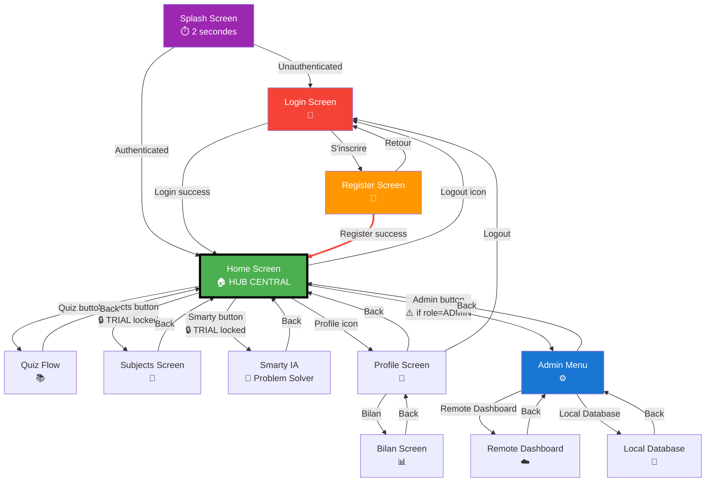
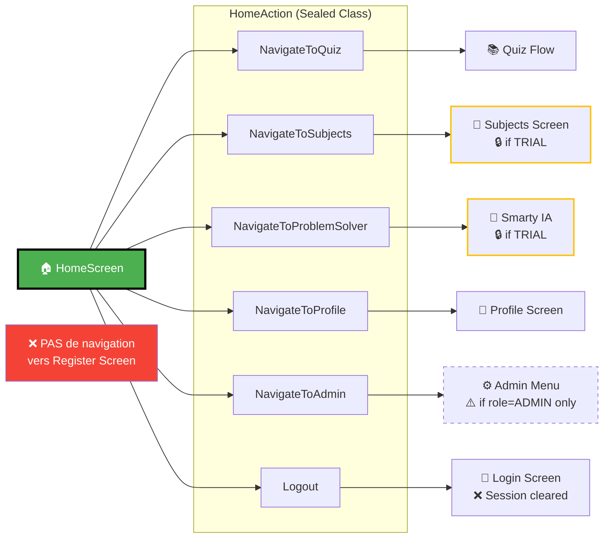
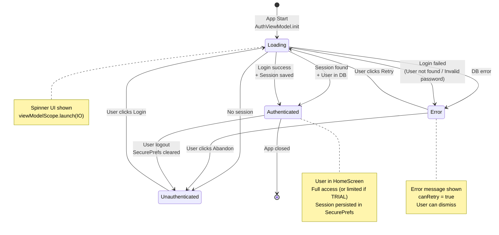
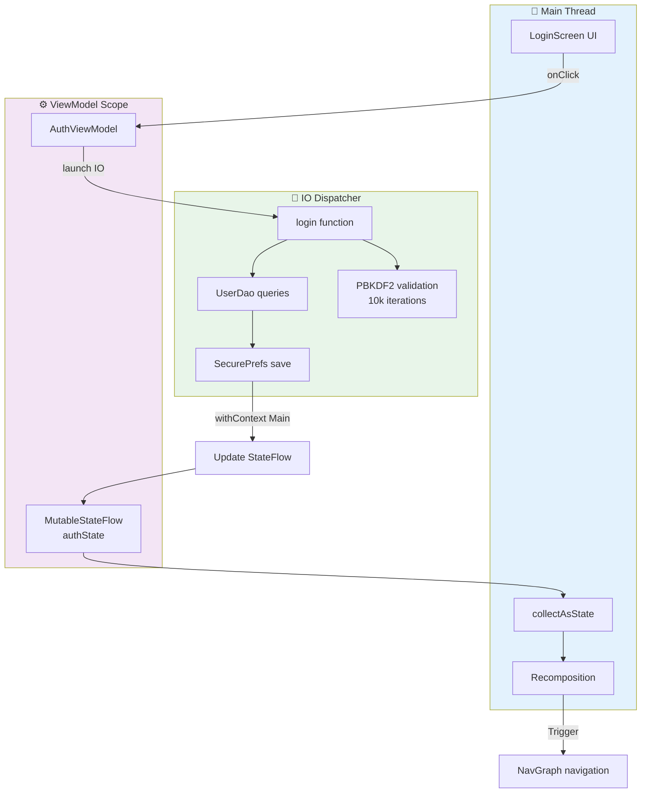

# 📊 Diagrammes de Flux Corrigés - Basés sur le Code Réel

**Date**: 2025-12-03  
**Version**: 1.0 (Corrigé)  

> ⚠️ **Note** : Ces diagrammes ont été créés en analysant directement le code source et corrigent les erreurs des diagrammes générés automatiquement.

---

## ❌ Erreurs Corrigées

1. **Splash Screen** : Il n'y a qu'**UN SEUL** Splash Screen, pas deux
2. **HomeScreen → Register** : Cette navigation **N'EXISTE PAS** dans le code
3. **Flux simplifié** : Basé uniquement sur le code réel vérifié

---

## 1️⃣ Flux Complet de Login (CORRIGÉ)

```mermaid
flowchart TD
    Start([🚀 MainActivity.onCreate]) --> AuthInit[AuthViewModel.initialize<br/>Dispatchers.IO]
    
    AuthInit --> CleanExpired[🧹 Nettoyage comptes expirés<br/>deleteExpiredUnsyncedUsers]
    CleanExpired --> CheckSession[🔍 SecurePrefs.getUserId]
    
    CheckSession --> HasSession{Session<br/>trouvée?}
    
    HasSession -->|Non| SetUnauth[AuthState.Unauthenticated]
    HasSession -->|Oui| LoadUser[UserDao.getUserById]
    LoadUser --> SetAuth[AuthState.Authenticated]
    
    SetUnauth --> DetermineDest{Déterminer<br/>postSplashDest}
    SetAuth --> DetermineDest
    
    DetermineDest -->|Authenticated| DestHome[postSplash = Home]
    DetermineDest -->|Unauthenticated| DestLogin[postSplash = Login]
    
    DestHome --> NavGraph[NavGraph démarre sur<br/>Screen.Splash TOUJOURS]
    DestLogin --> NavGraph
    
    NavGraph --> ShowSplash[📱 UN SEUL Splash Screen<br/>Animation 2 secondes]
    
    ShowSplash --> NavDecision{postSplashDest?}
    
    NavDecision -->|Home| NavToHome[Navigation → HomeScreen]
    NavDecision -->|Login| NavToLogin[Navigation → LoginScreen]
    
    NavToHome --> HomeMenu[🏠 Menu Principal]
    
    NavToLogin --> UserInput[👤 User entre pseudo + code]
    UserInput --> ValidInput{Input<br/>valide?}
    
    ValidInput -->|Non| UserInput
    ValidInput -->|Oui| ClickLogin[Click Se connecter]
    
    ClickLogin --> VmLogin[AuthViewModel.login<br/>Dispatchers.IO]
    VmLogin --> SetLoading[AuthState.Loading]
    SetLoading --> RepoLogin[AuthRepository.login]
    
    RepoLogin --> QueryUser[UserDao.getUserByPseudo]
    QueryUser --> UserExists{User<br/>trouvé?}
    
    UserExists -->|Non| Error1[❌ Error: Compte non trouvé]
    UserExists -->|Oui| ValidatePass[🔐 Validation PBKDF2<br/>10k iterations]
    
    ValidatePass --> PassValid{Hash<br/>match?}
    
    PassValid -->|Non| Error2[❌ Error: Code incorrect]
    PassValid -->|Oui| CreateSession[✅ Créer Session]
    
    CreateSession --> SaveId[SecurePrefs.saveUserId]
    SaveId --> SaveCreds[SecurePrefs.saveOfflineCredentials]
    SaveCreds --> SaveMode[SecurePrefs.saveAuthMode]
    SaveMode --> UpdateAuth[AuthState.Authenticated<br/>Dispatchers.Main]
    
    UpdateAuth --> NavObserve[NavGraph observe authState]
    NavObserve --> NavHome[Navigate → HomeScreen]
    NavHome --> HomeMenu
    
    Error1 --> ShowError[Afficher Error UI]
    Error2 --> ShowError
    ShowError --> Retry{Réessayer?}
    Retry -->|Oui| UserInput
    Retry -->|Non| ShowError
    
    style Start fill:#9C27B0,color:#fff
    style HomeMenu fill:#4CAF50,color:#fff
    style ShowSplash fill:#673AB7,color:#fff
    style CreateSession fill:#FF9800,color:#fff
    style Error1 fill:#F44336,color:#fff
    style Error2 fill:#F44336,color:#fff
    style ValidatePass fill:#9C27B0,color:#fff
```



---

## 2️⃣ Navigation Complète de l'Application (CORRIGÉ)



---

## 3️⃣ HomeScreen - Actions de Navigation Détaillées



---

## 4️⃣ Cycle de Vie AuthState (CORRIGÉ)



---

## 5️⃣ Threads & Dispatchers



---

## 📝 Résumé des Corrections

### ✅ Ce qui est correct maintenant :

1. **UN SEUL Splash Screen** - Affiché 2 secondes au démarrage
2. **Navigation HomeScreen** :
   - ✅ Quiz, Subjects, Smarty IA, Profile, Admin Menu (si ADMIN), Logout
   - ❌ **PAS de navigation vers Register**
3. **Flux Login** :
   - Vérification session → Splash → Login (si nécessaire) → Home
   - Validation PBKDF2 avec 10k iterations
   - Session sauvegardée dans SecurePrefs (chiffré AES-256)

### 🔍 Sources vérifiées :

- ✅ `MainActivity.kt` (lignes 74-95)
- ✅ `NavGraph.kt` (lignes 88-115)
- ✅ `HomeScreen.kt` (lignes 36-43, 94-119)
- ✅ `AuthViewModel.kt` (initialize, login)
- ✅ `AuthRepository.kt` (login, PBKDF2)

### 🎯 Navigation réelle depuis Home :

```kotlin
sealed class HomeAction : UiAction {
    object NavigateToQuiz : HomeAction()
    object NavigateToSubjects : HomeAction()
    object NavigateToProblemSolver : HomeAction()  // Smarty IA
    object NavigateToProfile : HomeAction()
    object NavigateToAdmin : HomeAction()
    object Logout : HomeAction()
    // ❌ PAS de NavigateToRegister
}
```

---

**📅 Dernière vérification** : 2025-12-03  
**✅ Basé sur le code source réel** : Analysé et vérifié  
**👨‍💻 EduCam - Bac-X_237**
