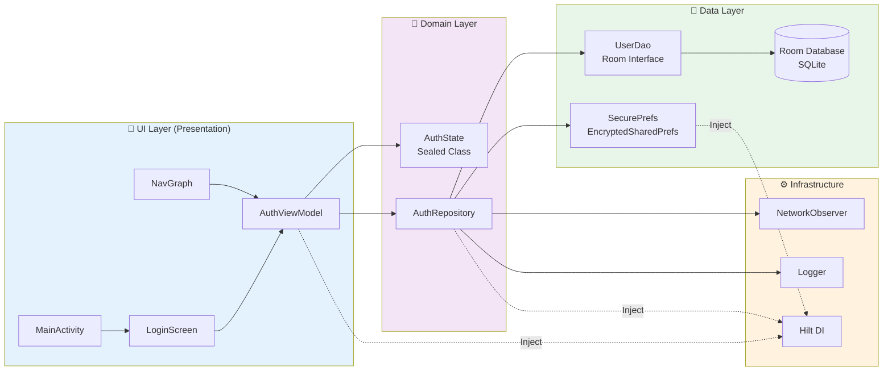
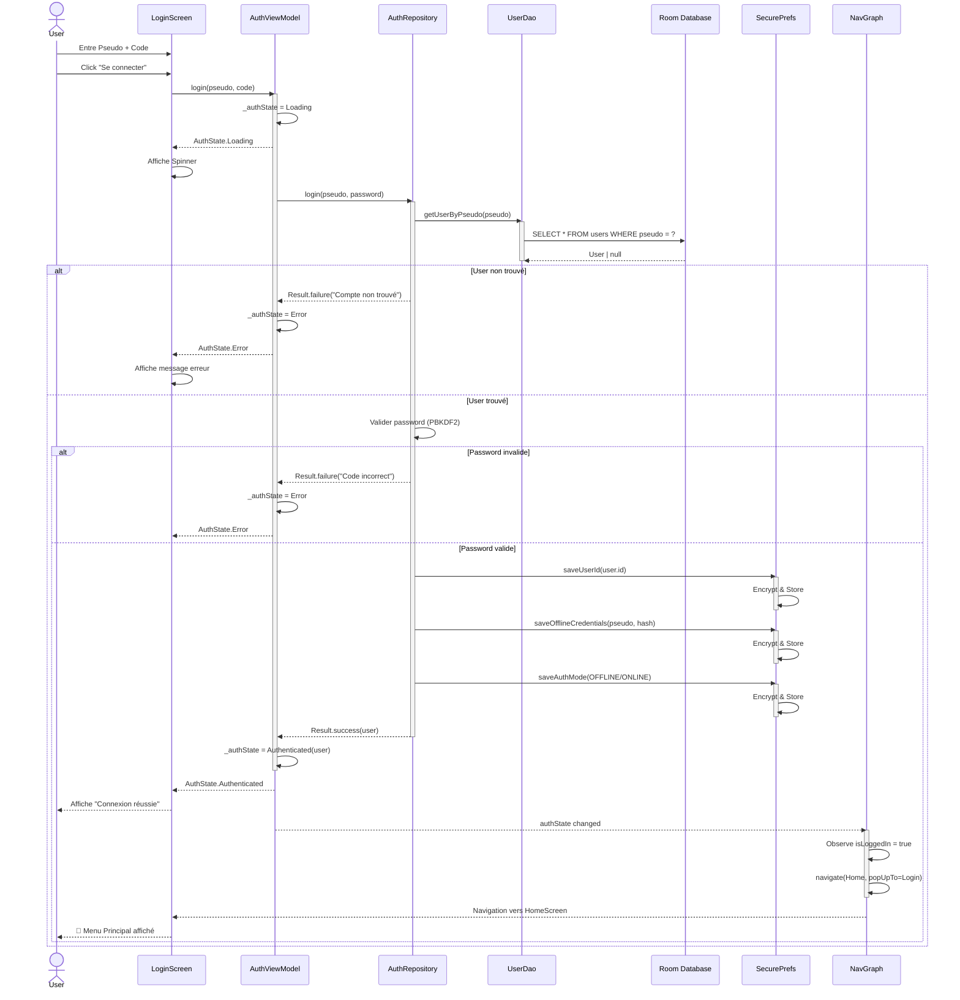
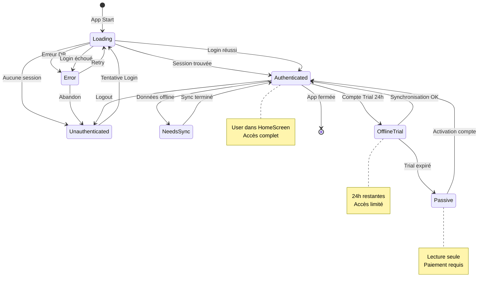
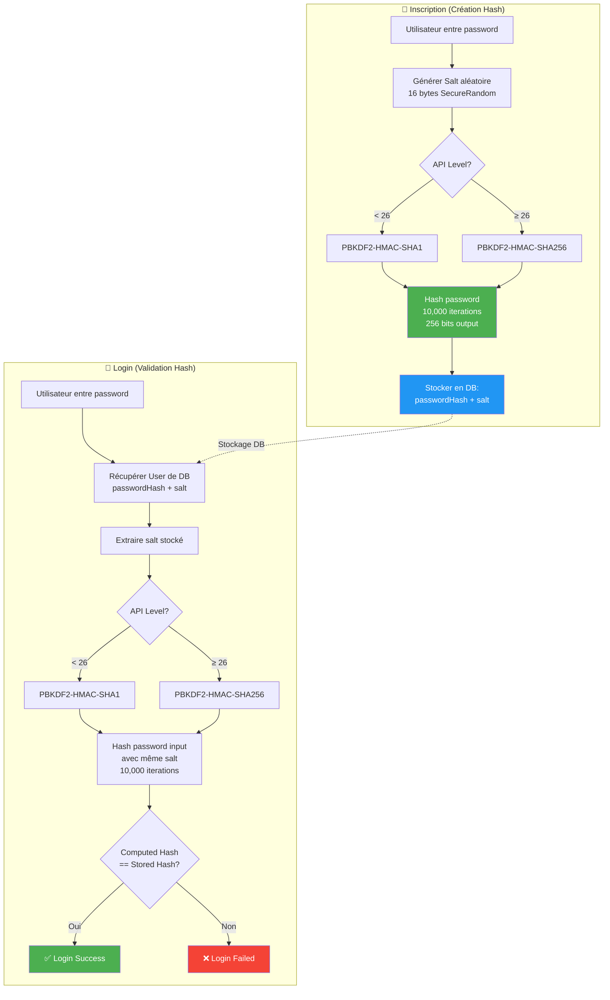
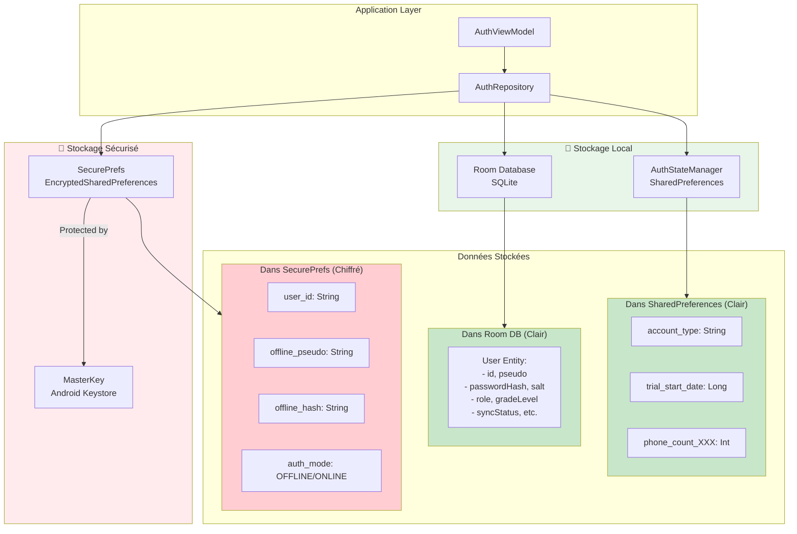
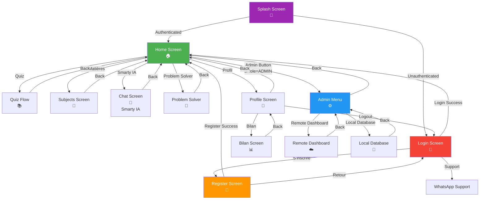
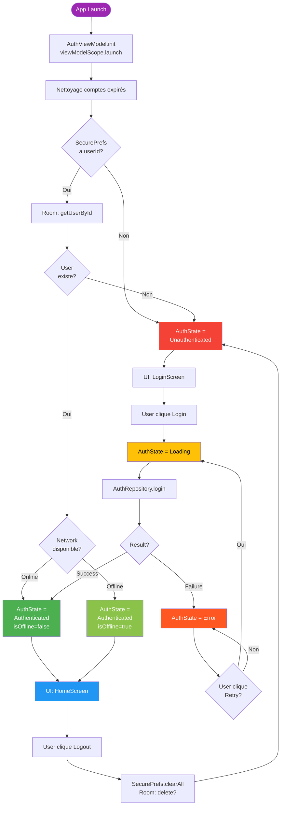
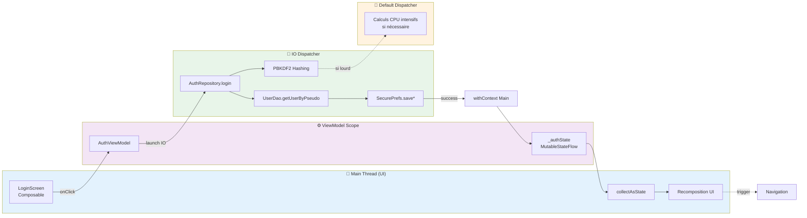
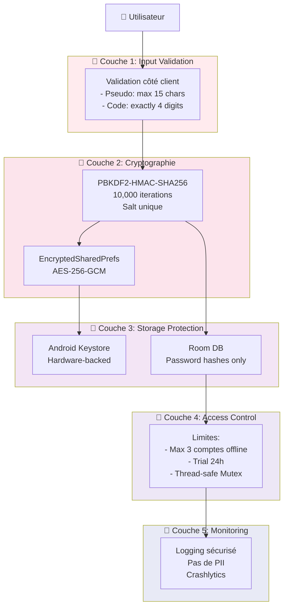

# 📊 Diagrammes du Processus de Login - EduCam

**Date**: 2025-12-03  
**Version**: 1.0  

> 💡 **Note**: Ces diagrammes sont rendus automatiquement dans GitHub, VS Code (avec extension), et la plupart des visualiseurs Markdown modernes.

---

## 🔄 Diagramme 1: Flux Complet - Du Démarrage au Menu Principal

Ce diagramme montre le flux complet depuis le lancement de l'application jusqu'à l'affichage du menu principal, incluant tous les chemins possibles (succès, erreurs, retry).

```mermaid
flowchart TD
    Start([🚀 Démarrage Application]) --> MainActivity[MainActivity.onCreate]
    MainActivity --> EnableEdge[enableEdgeToEdge]
    EnableEdge --> SetContent[setContent - Compose UI]
    
    SetContent --> InjectMain[Inject MainViewModel<br/>Gestion Thème]
    InjectMain --> ApplyTheme[Appliquer BacXTheme]
    ApplyTheme --> AppContent[appContent Composable]
    
    AppContent --> InjectVMs[Injection ViewModels Hilt]
    InjectVMs --> InjectAuth[AuthViewModel]
    InjectVMs --> InjectNav[NavigationViewModel]
    InjectVMs --> InjectMain2[MainViewModel]
    
    InjectAuth --> AuthInit[AuthViewModel.initialize]
    
    AuthInit --> CleanExpired[🧹 Nettoyage Comptes Expirés]
    CleanExpired --> CleanQuery{Comptes > 24h<br/>non synchronisés?}
    CleanQuery -->|Oui| DeleteExpired[UserDao.deleteExpiredUnsyncedUsers]
    CleanQuery -->|Non| CheckSession
    DeleteExpired --> CheckSession[🔍 Vérification Session]
    
    CheckSession --> GetUserId[SecurePrefs.getUserId]
    GetUserId --> HasSession{Session<br/>trouvée?}
    
    HasSession -->|Oui| LoadUser[AuthRepository.getUser]
    LoadUser --> QueryDB[UserDao.getUserById]
    QueryDB --> UserFound{User<br/>existe?}
    UserFound -->|Oui| SetAuthenticated[AuthState.Authenticated]
    UserFound -->|Non| SetUnauthenticated[AuthState.Unauthenticated]
    
    HasSession -->|Non| SetUnauthenticated
    
    SetAuthenticated --> DetermineStart{Déterminer<br/>Destination}
    SetUnauthenticated --> DetermineStart
    
    DetermineStart -->|Authenticated| StartHome[startDestination = Home]
    DetermineStart -->|Unauthenticated| StartLogin[startDestination = Login]
    
    StartHome --> ShowSplash[Afficher Splash Screen]
    StartLogin --> ShowSplash
    
    ShowSplash --> SplashDelay[Délai 2 secondes]
    SplashDelay --> NavDecision{AuthState?}
    
    NavDecision -->|Authenticated| NavToHome[Navigation → HomeScreen]
    NavDecision -->|Unauthenticated| NavToLogin[Navigation → LoginScreen]
    
    NavToHome --> HomeMenu[📱 Menu Principal Affiché]
    
    NavToLogin --> DisplayLogin[Afficher LoginScreen]
    DisplayLogin --> UserInput[👤 User Input<br/>Pseudo + Code]
    UserInput --> ValidInput{Input<br/>valide?}
    
    ValidInput -->|Non| DisplayLogin
    ValidInput -->|Oui| ClickLogin[onClick Login Button]
    
    ClickLogin --> VmLogin[AuthViewModel.login]
    VmLogin --> SetLoading[AuthState.Loading<br/>🔄 Spinner UI]
    SetLoading --> RepoLogin[AuthRepository.login]
    
    RepoLogin --> QueryUser[UserDao.getUserByPseudo]
    QueryUser --> UserExists{User<br/>trouvé?}
    
    UserExists -->|Non| LoginError1[Error: Compte non trouvé]
    UserExists -->|Oui| CheckHash{passwordHash<br/>vide?}
    
    CheckHash -->|Oui| LoginError2[Error: Sécurité]
    CheckHash -->|Non| ValidatePassword[Validation PBKDF2]
    
    ValidatePassword --> ExtractSalt[Extraire salt du User]
    ExtractSalt --> HashInput[Hash password input<br/>PBKDF2-HMAC-SHA256<br/>10k iterations]
    HashInput --> CompareHash{Hash<br/>correspond?}
    
    CompareHash -->|Non| LoginError3[Error: Code incorrect]
    CompareHash -->|Oui| CreateSession[✅ Créer Session]
    
    CreateSession --> SaveUserId[SecurePrefs.saveUserId]
    SaveUserId --> SaveCreds[SecurePrefs.saveOfflineCredentials]
    SaveCreds --> SaveMode[SecurePrefs.saveAuthMode]
    SaveMode --> ReturnSuccess[Result.success User]
    
    ReturnSuccess --> UpdateAuthState[AuthState.Authenticated<br/>sur Main Thread]
    UpdateAuthState --> NavGraphObserve[NavGraph LaunchedEffect<br/>observe authState]
    NavGraphObserve --> NavCheck{isLoggedIn &&<br/>currentRoute = Login?}
    
    NavCheck -->|Oui| NavCommand[NavigationViewModel.navigate]
    NavCommand --> PopBackstack[Pop jusqu'à Login<br/>inclusive=true]
    PopBackstack --> NavHomeScreen[Navigation → HomeScreen]
    NavHomeScreen --> HomeMenu
    
    LoginError1 --> ShowError[Afficher Error UI]
    LoginError2 --> ShowError
    LoginError3 --> ShowError
    ShowError --> RetryBtn{Click<br/>Réessayer?}
    RetryBtn -->|Oui| DisplayLogin
    RetryBtn -->|Non| ShowError
    
    style Start fill:#4CAF50,color:#fff
    style HomeMenu fill:#2196F3,color:#fff
    style CreateSession fill:#FF9800,color:#fff
    style LoginError1 fill:#F44336,color:#fff
    style LoginError2 fill:#F44336,color:#fff
    style LoginError3 fill:#F44336,color:#fff
    style SetLoading fill:#FFC107,color:#000
    style ValidatePassword fill:#9C27B0,color:#fff
```

---

## 🏗️ Diagramme 2: Architecture en Couches

Ce diagramme illustre l'organisation architecturale de l'application en couches distinctes avec leurs dépendances.

---

## 🔄 Diagramme 3: Séquence de Login Réussi

Ce diagramme de séquence montre les interactions entre composants lors d'un login réussi.

---

## 🔀 Diagramme 4: Machine à États d'Authentification

Ce diagramme montre tous les états possibles et leurs transitions.

---

## 🔐 Diagramme 5: Processus de Validation PBKDF2

Ce diagramme détaille le processus de hashing et validation des mots de passe.

---

## 🗄️ Diagramme 6: Architecture de Persistance des Données

Ce diagramme montre comment les données sont stockées et sécurisées.

---

## 🌐 Diagramme 7: Navigation Flow Complete

Ce diagramme montre tous les écrans et leurs connexions de navigation.

---

## 🔄 Diagramme 8: Cycle de Vie AuthState

Ce diagramme montre comment `AuthState` évolue durant le cycle de vie de l'application.

---

## 📱 Diagramme 9: Thread Management & Dispatchers

Ce diagramme illustre la gestion des threads et des dispatchers dans le processus d'authentification.

---

## 🔒 Diagramme 10: Sécurité Multi-Couches

Ce diagramme montre les différentes couches de sécurité implémentées.

---

## 📝 Légende des Symboles

| Symbole | Signification |
|---------|---------------|
| 🚀 | Point de démarrage |
| 📱 | Interface utilisateur |
| 🔐 | Sécurité / Authentification |
| 💾 | Stockage de données |
| 🔄 | Processus en cours |
| ✅ | Succès |
| ❌ | Échec |
| 🧹 | Nettoyage / Maintenance |
| 🔍 | Vérification |
| 👤 | Action utilisateur |
| ⚙️ | Configuration / Settings |
| 🌐 | Navigation |
| 📊 | Analytics / Rapports |
| 💬 | Communication |
| 🧮 | Calculs |

---

## 🎨 Codes Couleurs

- **Vert** (#4CAF50): Succès, états positifs
- **Rouge** (#F44336): Erreurs, états négatifs
- **Orange** (#FF9800): États intermédiaires importants
- **Jaune** (#FFC107): Avertissements, chargement
- **Bleu** (#2196F3): Navigation, destination finale
- **Violet** (#9C27B0): Processus critiques (validation, crypto)

---

**Note**: Pour une meilleure visualisation, ouvrez ce fichier dans :
- GitHub / GitLab (rendu automatique)
- VS Code (avec extension "Markdown Preview Mermaid Support")
- Obsidian
- Typora
- MarkText

---

**Dernière mise à jour**: 2025-12-03  
**Version**: 1.0.0  
**Projet**: EduCam - Bac-X_237
