# 🔐 Documentation du Processus de Login - EduCam

**Date**: 2025-12-03  
**Version**: 1.0  
**Architecture**: Offline-First avec Synchronisation Différée

---

## 📋 Table des Matières

1. [Vue d'ensemble](#vue-densemble)
2. [Diagrammes de Flux](#diagrammes-de-flux)
3. [Composants Impliqués](#composants-impliqués)
4. [Flux Détaillé](#flux-détaillé)
5. [Modèles de Données](#modèles-de-données)
6. [Sécurité](#sécurité)
7. [États d'Authentification](#états-dauthentification)
8. [Gestion des Erreurs](#gestion-des-erreurs)

---

## 🎯 Vue d'ensemble

Le système d'authentification d'EduCam utilise une architecture **offline-first** basée sur les principes suivants :

- **Pattern MVI** (Model-View-Intent) pour la gestion d'état
- **Repository Pattern** pour l'abstraction des sources de données
- **Room Database** comme source de vérité locale
- **EncryptedSharedPreferences** pour la persistance sécurisée des sessions
- **Coroutines** avec gestion stricte des threads (IO/Main)
- **Hilt** pour l'injection de dépendances

---

## 📊 Diagrammes de Flux

### Diagramme 1: Flux Complet - Démarrage à Menu Principal

```mermaid
flowchart TD
    Start([🚀 Démarrage Application]) --> MainActivity[MainActivity.onCreate]
    MainActivity --> EnableEdge[enableEdgeToEdge]
    EnableEdge --> SetContent[setContent - Compose UI]
    
    SetContent --> InjectMain[Inject MainViewModel<br/>Gestion Thème]
    InjectMain --> ApplyTheme[Appliquer BacXTheme]
    ApplyTheme --> AppContent[appContent Composable]
    
    AppContent --> InjectVMs[Injection ViewModels Hilt]
    InjectVMs --> InjectAuth[AuthViewModel]
    InjectVMs --> InjectNav[NavigationViewModel]
    InjectVMs --> InjectMain2[MainViewModel]
    
    InjectAuth --> AuthInit[AuthViewModel.initialize]
    
    AuthInit --> CleanExpired[🧹 Nettoyage Comptes Expirés]
    CleanExpired --> CleanQuery{Comptes > 24h<br/>non synchronisés?}
    CleanQuery -->|Oui| DeleteExpired[UserDao.deleteExpiredUnsyncedUsers]
    CleanQuery -->|Non| CheckSession
    DeleteExpired --> CheckSession[🔍 Vérification Session]
    
    CheckSession --> GetUserId[SecurePrefs.getUserId]
    GetUserId --> HasSession{Session<br/>trouvée?}
    
    HasSession -->|Oui| LoadUser[AuthRepository.getUser]
    LoadUser --> QueryDB[UserDao.getUserById]
    QueryDB --> UserFound{User<br/>existe?}
    UserFound -->|Oui| SetAuthenticated[AuthState.Authenticated]
    UserFound -->|Non| SetUnauthenticated[AuthState.Unauthenticated]
    
    HasSession -->|Non| SetUnauthenticated
    
    SetAuthenticated --> DetermineStart{Déterminer<br/>Destination}
    SetUnauthenticated --> DetermineStart
    
    DetermineStart -->|Authenticated| StartHome[startDestination = Home]
    DetermineStart -->|Unauthenticated| StartLogin[startDestination = Login]
    
    StartHome --> ShowSplash[Afficher Splash Screen]
    StartLogin --> ShowSplash
    
    ShowSplash --> SplashDelay[Délai 2 secondes]
    SplashDelay --> NavDecision{AuthState?}
    
    NavDecision -->|Authenticated| NavToHome[Navigation → HomeScreen]
    NavDecision -->|Unauthenticated| NavToLogin[Navigation → LoginScreen]
    
    NavToHome --> HomeMenu[📱 Menu Principal Affiché]
    
    NavToLogin --> DisplayLogin[Afficher LoginScreen]
    DisplayLogin --> UserInput[👤 User Input<br/>Pseudo + Code]
    UserInput --> ValidInput{Input<br/>valide?}
    
    ValidInput -->|Non| DisplayLogin
    ValidInput -->|Oui| ClickLogin[onClick Login Button]
    
    ClickLogin --> VmLogin[AuthViewModel.login]
    VmLogin --> SetLoading[AuthState.Loading<br/>🔄 Spinner UI]
    SetLoading --> RepoLogin[AuthRepository.login]
    
    RepoLogin --> QueryUser[UserDao.getUserByPseudo]
    QueryUser --> UserExists{User<br/>trouvé?}
    
    UserExists -->|Non| LoginError1[Error: Compte non trouvé]
    UserExists -->|Oui| CheckHash{passwordHash<br/>vide?}
    
    CheckHash -->|Oui| LoginError2[Error: Sécurité]
    CheckHash -->|Non| ValidatePassword[Validation PBKDF2]
    
    ValidatePassword --> ExtractSalt[Extraire salt du User]
    ExtractSalt --> HashInput[Hash password input<br/>PBKDF2-HMAC-SHA256<br/>10k iterations]
    HashInput --> CompareHash{Hash<br/>correspond?}
    
    CompareHash -->|Non| LoginError3[Error: Code incorrect]
    CompareHash -->|Oui| CreateSession[✅ Créer Session]
    
    CreateSession --> SaveUserId[SecurePrefs.saveUserId]
    SaveUserId --> SaveCreds[SecurePrefs.saveOfflineCredentials]
    SaveCreds --> SaveMode[SecurePrefs.saveAuthMode]
    SaveMode --> ReturnSuccess[Result.success User]
    
    ReturnSuccess --> UpdateAuthState[AuthState.Authenticated<br/>sur Main Thread]
    UpdateAuthState --> NavGraphObserve[NavGraph LaunchedEffect<br/>observe authState]
    NavGraphObserve --> NavCheck{isLoggedIn &&<br/>currentRoute = Login?}
    
    NavCheck -->|Oui| NavCommand[NavigationViewModel.navigate]
    NavCommand --> PopBackstack[Pop jusqu'à Login<br/>inclusive=true]
    PopBackstack --> NavHomeScreen[Navigation → HomeScreen]
    NavHomeScreen --> HomeMenu
    
    LoginError1 --> ShowError[Afficher Error UI]
    LoginError2 --> ShowError
    LoginError3 --> ShowError
    ShowError --> RetryBtn{Click<br/>Réessayer?}
    RetryBtn -->|Oui| DisplayLogin
    RetryBtn -->|Non| ShowError
    
    style Start fill:#4CAF50,color:#fff
    style HomeMenu fill:#2196F3,color:#fff
    style CreateSession fill:#FF9800,color:#fff
    style LoginError1 fill:#F44336,color:#fff
    style LoginError2 fill:#F44336,color:#fff
    style LoginError3 fill:#F44336,color:#fff
    style SetLoading fill:#FFC107,color:#000
    style ValidatePassword fill:#9C27B0,color:#fff
```



### Diagramme 2: Architecture en Couches

```mermaid
flowchart LR
    subgraph UI["🎨 UI Layer (Presentation)"]
        MainActivity[MainActivity]
        LoginScreen[LoginScreen]
        NavGraph[NavGraph]
        AuthVM[AuthViewModel]
    end
    
    subgraph Domain["🧠 Domain Layer"]
        AuthState[AuthState<br/>Sealed Class]
        AuthRepo[AuthRepository]
    end
    
    subgraph Data["💾 Data Layer"]
        SecurePrefs[SecurePrefs<br/>EncryptedSharedPrefs]
        UserDao[UserDao<br/>Room Interface]
        RoomDB[(Room Database<br/>SQLite)]
    end
    
    subgraph Infrastructure["⚙️ Infrastructure"]
        NetworkObs[NetworkObserver]
        Logger[Logger]
        Hilt[Hilt DI]
    end
    
    MainActivity --> LoginScreen
    LoginScreen --> AuthVM
    AuthVM --> AuthState
    AuthVM --> AuthRepo
    NavGraph --> AuthVM
    
    AuthRepo --> SecurePrefs
    AuthRepo --> UserDao
    AuthRepo --> NetworkObs
    UserDao --> RoomDB
    
    AuthVM -.Inject.-> Hilt
    AuthRepo -.Inject.-> Hilt
    SecurePrefs -.Inject.-> Hilt
    
    AuthRepo --> Logger
    
    style UI fill:#E3F2FD
    style Domain fill:#F3E5F5
    style Data fill:#E8F5E9
    style Infrastructure fill:#FFF3E0
```



### Diagramme 3: Séquence de Login Réussi

```mermaid
sequenceDiagram
    actor User
    participant UI as LoginScreen
    participant VM as AuthViewModel
    participant Repo as AuthRepository
    participant DAO as UserDao
    participant DB as Room Database
    participant SP as SecurePrefs
    participant Nav as NavGraph
    
    User->>UI: Entre Pseudo + Code
    User->>UI: Click "Se connecter"
    
    UI->>VM: login(pseudo, code)
    activate VM
    VM->>VM: _authState = Loading
    VM-->>UI: AuthState.Loading
    UI->>UI: Affiche Spinner
    
    VM->>Repo: login(pseudo, password)
    activate Repo
    
    Repo->>DAO: getUserByPseudo(pseudo)
    activate DAO
    DAO->>DB: SELECT * FROM users WHERE pseudo = ?
    DB-->>DAO: User | null
    deactivate DAO
    
    alt User non trouvé
        Repo-->>VM: Result.failure("Compte non trouvé")
        VM->>VM: _authState = Error
        VM-->>UI: AuthState.Error
        UI->>UI: Affiche message erreur
    else User trouvé
        Repo->>Repo: Valider password (PBKDF2)
        
        alt Password invalide
            Repo-->>VM: Result.failure("Code incorrect")
            VM->>VM: _authState = Error
            VM-->>UI: AuthState.Error
        else Password valide
            Repo->>SP: saveUserId(user.id)
            activate SP
            SP->>SP: Encrypt & Store
            deactivate SP
            
            Repo->>SP: saveOfflineCredentials(pseudo, hash)
            activate SP
            SP->>SP: Encrypt & Store
            deactivate SP
            
            Repo->>SP: saveAuthMode(OFFLINE/ONLINE)
            activate SP
            SP->>SP: Encrypt & Store
            deactivate SP
            
            Repo-->>VM: Result.success(user)
            deactivate Repo
            
            VM->>VM: _authState = Authenticated(user)
            deactivate VM
            VM-->>UI: AuthState.Authenticated
            UI-->>User: Affiche "Connexion réussie"
            
            VM-->>Nav: authState changed
            activate Nav
            Nav->>Nav: Observe isLoggedIn = true
            Nav->>Nav: navigate(Home, popUpTo=Login)
            deactivate Nav
            
            Nav-->>UI: Navigation vers HomeScreen
            UI-->>User: 📱 Menu Principal affiché
        end
    end
```



### Diagramme 4: États et Transitions

```mermaid
stateDiagram-v2
    [*] --> Loading: App Start
    
    Loading --> Authenticated: Session trouvée
    Loading --> Unauthenticated: Aucune session
    Loading --> Error: Erreur DB
    
    Unauthenticated --> Loading: Tentative Login
    
    Loading --> Authenticated: Login réussi
    Loading --> Error: Login échoué
    
    Error --> Loading: Retry
    Error --> Unauthenticated: Abandon
    
    Authenticated --> NeedsSync: Données offline
    Authenticated --> Unauthenticated: Logout
    Authenticated --> OfflineTrial: Compte Trial 24h
    
    OfflineTrial --> Passive: Trial expiré
    OfflineTrial --> Authenticated: Synchronisation OK
    
    NeedsSync --> Authenticated: Sync terminé
    
    Passive --> Authenticated: Activation compte
    
    Authenticated --> [*]: App fermée
    
    note right of Authenticated
        User dans HomeScreen
        Accès complet
    end note
    
    note right of OfflineTrial
        24h restantes
        Accès limité
    end note
    
    note right of Passive
        Lecture seule
        Paiement requis
    end note
```



---

## 🧩 Composants Impliqués

### A. Couche UI (Presentation)

#### **MainActivity.kt**
- **Rôle**: Point d'entrée de l'application
- **Responsabilités**:
  - Configuration `enableEdgeToEdge()`
  - Injection des ViewModels Hilt
  - Application du thème dynamique
  - Initialisation du NavController
- **Technologies**: Jetpack Compose, Hilt DI

#### **LoginScreen.kt** (Composable)
- **Rôle**: Interface utilisateur de connexion
- **Responsabilités**:
  - Collecte inputs (pseudo, code)
  - Validation locale des champs
  - Observation de `AuthState.authState: StateFlow`
  - Affichage conditionnel selon l'état (Loading, Error, Success)
  - Navigation automatique via `LaunchedEffect`
- **Callbacks**:
  - `onLoginSuccess: () -> Unit` (no-op, navigation centralisée)
  - `onNavigateToRegister: () -> Unit`

#### **NavGraph.kt**
- **Rôle**: Gestion centralisée de la navigation
- **Responsabilités**:
  - Observation globale de `authState`
  - Navigation automatique Login ↔ Home
  - Gestion du backstack (popUpTo, inclusive)
  - Protection contre race conditions
- **Particularités**:
  - `NavController` attaché via `SideEffect`
  - Vérification `currentBackStackEntry != null`
  - `singleTop = true` pour éviter duplications

#### **AuthViewModel.kt**
- **Rôle**: Gestion de l'état d'authentification
- **Champs**:
  - `_authState: MutableStateFlow<AuthState>`
  - `authState: StateFlow<AuthState>` (public, readonly)
- **Méthodes principales**:
  - `initialize()`: Vérification session au démarrage
  - `login(pseudo, code)`: Tentative de connexion
  - `register(...)`: Création de compte
  - `logout()`: Déconnexion
  - `retry()`: Réessayer après erreur
- **Thread Management**:
  - Exécution sur `viewModelScope.launch(Dispatchers.IO)`
  - Update state sur `Dispatchers.Main`

---

### B. Couche Domain (Business Logic)

#### **AuthState.kt** (Sealed Class)
```kotlin
sealed class AuthState {
    object Loading
    data class Authenticated(val user: User, val isOffline: Boolean)
    data class Unauthenticated(val reason: String?)
    data class Error(val message: String, val canRetry: Boolean)
    object NeedsRegistration
    data class NeedsSync(val user: User, val pendingChanges: Int)
    data class Passive(val user: User, val reason: String)
    data class OfflineTrial(val user: User, val expiresAt: Long)
}
```

#### **AuthRepository.kt**
- **Rôle**: Logique métier d'authentification
- **Méthodes critiques**:

##### `login(pseudo: String, password: String): Result<User>`
1. Query DB via `UserDao.getUserByPseudo()`
2. Vérification existence du user
3. Validation password avec PBKDF2:
   - Extraction du `salt` stocké
   - Hash du password input (10k iterations)
   - Comparaison avec `passwordHash` stocké
4. Si valide:
   - `SecurePrefs.saveUserId()`
   - `SecurePrefs.saveOfflineCredentials()`
   - `SecurePrefs.saveAuthMode()`
5. Return `Result.success(user)` ou `Result.failure(exception)`

##### `cleanExpiredOfflineAccounts(): Int`
- Supprime comptes offline non synchronisés > 24h
- Calcul: `expiryTimestamp = now - 24h`
- Appel: `UserDao.deleteExpiredUnsyncedUsers(timestamp)`

##### `getUser(): Result<User>`
- Source of Truth: Local DB (Room)
- Fallback: Firestore si online
- Return User avec métadonnées complètes

---

### C. Couche Data (Persistence)

#### **SecurePrefs.kt**
- **Technologie**: `EncryptedSharedPreferences` (AndroidX Security-Crypto)
- **Encryption**:
  - **MasterKey**: `AES256_GCM`
  - **Key Scheme**: `AES256_SIV`
  - **Value Scheme**: `AES256_GCM`

**Données stockées**:
```kotlin
"user_id" -> String           // UUID de l'utilisateur connecté
"offline_pseudo" -> String    // Pour re-login offline
"offline_hash" -> String      // Password hash pour validation locale
"auth_mode" -> String         // "OFFLINE" | "ONLINE"
```

**Méthodes clés**:
- `saveUserId(id: String)`
- `getUserId(): String?`
- `saveOfflineCredentials(pseudo, hash)`
- `getOfflineCredentials(): Pair<String, String>?`
- `saveAuthMode(mode: AuthMode)`
- `clearAllAuthData()`

#### **UserDao.kt** (Room Interface)
```kotlin
@Dao
interface UserDao {
    @Query("SELECT * FROM users WHERE pseudo = :pseudo LIMIT 1")
    suspend fun getUserByPseudo(pseudo: String): User?
    
    @Query("SELECT * FROM users WHERE id = :id LIMIT 1")
    fun getUserById(id: String): Flow<User?>
    
    @Insert(onConflict = OnConflictStrategy.REPLACE)
    suspend fun insertUser(user: User)
    
    @Update
    suspend fun updateUser(user: User)
    
    @Query("DELETE FROM users WHERE syncStatus != 'SYNCED' AND createdAt < :expiryTimestamp")
    suspend fun deleteExpiredUnsyncedUsers(expiryTimestamp: Long): Int
    
    @Query("SELECT COUNT(*) FROM users WHERE isOfflineAccount = 1")
    suspend fun countOfflineUsers(): Int
}
```

#### **User Entity** (Room)
Champs principaux:
- `id: String` (UUID)
- `pseudo: String` (unique)
- `passwordHash: String` (PBKDF2)
- `salt: String` (pour hashing)
- `role: String` ("ACTIVE", "PASSIVE", "ADMIN", "BETA_T")
- `isOfflineAccount: Boolean`
- `syncStatus: String` ("SYNCED", "PENDING", "FAILED")
- `createdAt: Long` (timestamp)
- `trialExpiresAt: Long?` (si compte trial)

---

### D. Infrastructure

#### **AuthStateManager.kt**
- **Type**: SharedPreferences classique (non crypté)
- **Usage**: Cache léger pour données non sensibles
- **Méthodes**:
  - `saveAccountType(type: String)`
  - `getAccountsForPhone(phone: String): Int`
  - `isTrialExpired(): Boolean`

#### **NetworkObserver.kt**
- **Rôle**: Détection état réseau
- **Méthode**: `isOnline(): Boolean`
- **Usage**: Déterminer `isOffline` dans `AuthState.Authenticated`

#### **Logger.kt**
- **Intégrations**:
  - Logcat Android (`android.util.Log`)
  - Firebase Crashlytics
- **Méthodes**:
  - `d(tag, message)` - Debug
  - `i(tag, message)` - Info
  - `w(tag, message)` - Warning
  - `e(tag, message, throwable)` - Error
  - `logUserAction(action, params)` - Analytics

#### **DatabaseCallback.kt**
- **Rôle**: Initialisation DB au premier démarrage
- **Actions**:
  - Insertion de questions samples
  - Vérification intégrité des données
  - Logs de création

---

## 🔄 Flux Détaillé

### Phase 1: Initialisation Application

```
MainActivity.onCreate()
  ↓
setContent { 
    BacXTheme(themeIndex) {
        appContent()
    }
}
  ↓
appContent() {
    val authViewModel = hiltViewModel<AuthViewModel>()
    val navigationViewModel = hiltViewModel<NavigationViewModel>()
    val mainViewModel = hiltViewModel<MainViewModel>()
    
    val navController = rememberNavController()
    
    // ⚡ CRITIQUE: Attachment immédiat pour éviter race conditions
    SideEffect {
        navigationViewModel.setNavController(navController)
    }
    
    // Observation de authState pour déterminer startDestination
    val authState by authViewModel.authState.collectAsState()
    val startDestination = when (authState) {
        is Authenticated -> Screen.Home.route
        else -> Screen.Login.route
    }
    
    NavGraph(
        navController = navController,
        startDestination = Screen.Splash.route,
        postSplashDestination = startDestination
    )
}
```

### Phase 2: AuthViewModel.initialize()

**Thread**: `viewModelScope.launch(Dispatchers.IO)`

```kotlin
// 1. Nettoyage des comptes expirés
launch {
    try {
        val cleanedCount = authRepository.cleanExpiredOfflineAccounts()
        if (cleanedCount > 0) {
            Logger.i("Startup cleanup: removed $cleanedCount account(s)")
        }
    } catch (e: Exception) {
        // Non-bloquant: log et continue
        Logger.e("Cleanup failed (non-critical)", e)
    }
}

// 2. Vérification session existante
val result = authRepository.getUser()
result.onSuccess { user ->
    val isOffline = !networkObserver.isOnline()
    _authState.value = AuthState.Authenticated(user, isOffline)
}
result.onFailure { e ->
    _authState.value = AuthState.Unauthenticated(reason = e.message)
}
```

### Phase 3: Affichage Splash Screen

```kotlin
SplashScreen(postSplashDestination) {
    delay(2000) // Animation logo
    navigationViewModel.navigate(
        NavCommand.NavigateTo(
            route = postSplashDestination,
            popUpTo = Screen.Splash.route,
            inclusive = true
        )
    )
}
```

**Résultat**:
- Si `Authenticated` → Navigation vers `HomeScreen`
- Si `Unauthenticated` → Navigation vers `LoginScreen`

### Phase 4: LoginScreen - Collecte Inputs

```kotlin
LoginScreen(onLoginSuccess, onNavigateToRegister) {
    var pseudo by remember { mutableStateOf("") }
    var code by remember { mutableStateOf("") }
    
    val authState by viewModel.authState.collectAsState()
    
    // 🔥 Navigation automatique
    LaunchedEffect(authState) {
        if (authState is AuthState.Authenticated) {
            onLoginSuccess()
        }
    }
    
    OutlinedTextField(
        value = pseudo,
        onValueChange = { if (it.length <= 15) pseudo = it },
        label = { Text("Pseudo") }
    )
    
    OutlinedTextField(
        value = code,
        onValueChange = { 
            if (it.length <= 4 && it.all { ch -> ch.isDigit() }) 
                code = it 
        },
        label = { Text("Code (4 chiffres)") },
        visualTransformation = PasswordVisualTransformation()
    )
    
    PrimaryButton(
        onClick = { viewModel.login(pseudo, code) },
        enabled = pseudo.isNotBlank() && code.length == 4,
        text = "Se connecter"
    )
}
```

### Phase 5: AuthViewModel.login()

**Thread**: `Dispatchers.IO` → `Dispatchers.Main` pour state update

```kotlin
fun login(pseudo: String, code: String) {
    viewModelScope.launch(Dispatchers.IO) {
        // 1. Set Loading state
        _authState.value = AuthState.Loading
        
        // 2. Call repository
        authRepository.login(pseudo, code)
            .onSuccess { user ->
                // 3. Success: Update state on Main thread
                withContext(Dispatchers.Main) {
                    _authState.value = AuthState.Authenticated(
                        user = user,
                        isOffline = !networkObserver.isOnline()
                    )
                }
            }
            .onFailure { e ->
                // 4. Failure: Show error
                withContext(Dispatchers.Main) {
                    _authState.value = AuthState.Error(
                        message = e.message ?: "Échec de connexion",
                        canRetry = true
                    )
                }
            }
    }
}
```

### Phase 6: AuthRepository.login() - Validation Credentials

```kotlin
suspend fun login(pseudo: String, password: String): Result<User> {
    return try {
        // 1. Query DB locale
        val user = userDao.getUserByPseudo(pseudo)
            ?: return Result.failure(Exception("Aucun compte trouvé"))
        
        // 2. Vérifier hash non vide (sécurité)
        if (user.passwordHash.isEmpty()) {
            return Result.failure(Exception("Compte invalide"))
        }
        
        // 3. Validation PBKDF2
        val isPasswordValid = validatePassword(password, user.salt, user.passwordHash)
        
        if (isPasswordValid) {
            // 4. Créer session sécurisée
            securePrefs.saveUserId(user.id)
            securePrefs.saveOfflineCredentials(user.pseudo, user.passwordHash)
            
            val authMode = if (user.isOfflineAccount) {
                SecurePrefs.AuthMode.OFFLINE
            } else {
                SecurePrefs.AuthMode.ONLINE
            }
            securePrefs.saveAuthMode(authMode)
            
            Logger.i("Login successful: ${user.id}")
            Result.success(user)
        } else {
            Logger.w("Login failed: Invalid password")
            Result.failure(Exception("Code incorrect"))
        }
    } catch (e: Exception) {
        Logger.e("Login error", e)
        Result.failure(Exception("Erreur lors de la connexion"))
    }
}

private fun validatePassword(input: String, salt: String, storedHash: String): Boolean {
    val spec = PBEKeySpec(
        input.toCharArray(),
        salt.toByteArray(),
        10000,  // iterations
        256     // key length
    )
    val factory = SecretKeyFactory.getInstance(getPBKDF2Algorithm())
    val computedHash = factory.generateSecret(spec).encoded.joinToString("") { 
        "%02x".format(it) 
    }
    return computedHash == storedHash
}

private fun getPBKDF2Algorithm(): String {
    return if (Build.VERSION.SDK_INT >= Build.VERSION_CODES.O) {
        "PBKDF2WithHmacSHA256"
    } else {
        "PBKDF2WithHmacSHA1"
    }
}
```

### Phase 7: NavGraph - Navigation Automatique

```kotlin
NavGraph(...) {
    val authState by authViewModel.authState.collectAsState()
    val isLoggedIn = authState is AuthState.Authenticated
    
    // 🔥 NAVIGATION REACTIVE
    LaunchedEffect(isLoggedIn) {
        val currentRoute = navController.currentDestination?.route
        
        // Vérifier NavController prêt
        if (navController.currentBackStackEntry == null) {
            Logger.w("NavController not ready - waiting")
            return@LaunchedEffect
        }
        
        // Si login réussi depuis écran auth → Go Home
        if (isLoggedIn && currentRoute in listOf(
            Screen.Login.route, 
            Screen.Register.route, 
            Screen.Splash.route
        )) {
            navigationViewModel.navigate(
                NavCommand.NavigateTo(
                    route = Screen.Home.route,
                    popUpTo = Screen.Login.route,
                    inclusive = true,
                    singleTop = true
                )
            )
        }
        // Si logout depuis app → Go Login
        else if (!isLoggedIn && currentRoute !in listOf(
            Screen.Login.route, 
            Screen.Register.route
        )) {
            navigationViewModel.navigate(
                NavCommand.NavigateAndClear(Screen.Login.route)
            )
        }
    }
    
    // Définition des destinations...
    composable(Screen.Home.route) {
        HomeScreen(...)
    }
}
```

### Phase 8: HomeScreen Affichage

**Arrivée sur le menu principal** ✅

```kotlin
HomeScreen(navigationViewModel, mainViewModel) {
    // UI: Grille de boutons
    // - Quiz
    // - Matières
    // - Smarty IA
    // - Problem Solver
    // - Profil
    // - (Admin Menu si role = ADMIN)
}
```

---

## 📦 Modèles de Données

### User Entity (Room)

```kotlin
@Entity(tableName = "users")
data class User(
    @PrimaryKey val id: String = UUID.randomUUID().toString(),
    
    // Authentification
    val pseudo: String,
    val passwordHash: String,  // PBKDF2 hash
    val salt: String,          // Unique salt
    
    // Profil
    val fullName: String,
    val gradeLevel: String,    // "6ème", "3ème", "Tle A", etc.
    val school: String? = null,
    val city: String? = null,
    
    // Rôle et permissions
    val role: String = "PASSIVE", // ACTIVE, PASSIVE, ADMIN, BETA_T
    
    // Offline-First
    val isOfflineAccount: Boolean = false,
    val syncStatus: String = "SYNCED", // SYNCED, PENDING, FAILED
    val trialExpiresAt: Long? = null,  // Timestamp trial 24h
    
    // Métadonnées
    val createdAt: Long = System.currentTimeMillis(),
    val lastSyncedAt: Long? = null,
    val deviceId: String? = null
) {
    fun getUserMode(): UserMode {
        return when {
            role == "ADMIN" -> UserMode.ADMIN
            role == "BETA_T" -> UserMode.BETA_TESTER
            role == "ACTIVE" -> UserMode.ACTIVE
            trialExpiresAt != null && System.currentTimeMillis() < trialExpiresAt -> 
                UserMode.TRIAL
            else -> UserMode.PASSIVE
        }
    }
}

enum class UserMode {
    ACTIVE,       // Accès illimité
    PASSIVE,      // Lecture seule ou limité
    TRIAL,        // 24h trial
    ADMIN,        // Accès total + admin tools
    BETA_TESTER   // Features expérimentales
}
```

### AuthState (Sealed Class)

```kotlin
sealed class AuthState {
    // Chargement initial ou action en cours
    object Loading : AuthState()
    
    // Utilisateur authentifié avec succès
    data class Authenticated(
        val user: User,
        val isOffline: Boolean = false
    ) : AuthState()
    
    // Aucune session active
    data class Unauthenticated(
        val reason: String? = null
    ) : AuthState()
    
    // Erreur lors de l'authentification
    data class Error(
        val message: String,
        val canRetry: Boolean = true
    ) : AuthState()
    
    // Redirection vers inscription nécessaire
    object NeedsRegistration : AuthState()
    
    // Compte avec données locales non synchronisées
    data class NeedsSync(
        val user: User,
        val pendingChanges: Int
    ) : AuthState()
    
    // Compte passif (accès limité)
    data class Passive(
        val user: User,
        val reason: String
    ) : AuthState()
    
    // Compte en période d'essai offline (24h)
    data class OfflineTrial(
        val user: User,
        val expiresAt: Long
    ) : AuthState()
}
```

---

## 🔐 Sécurité

### 1. Hashing de Mot de Passe (PBKDF2)

**Algorithme**: PBKDF2-HMAC-SHA256 (ou SHA1 pour API < 26)

**Paramètres**:
- **Iterations**: 10,000
- **Key Length**: 256 bits
- **Salt**: 16 bytes aléatoires (SecureRandom)

**Processus**:
```kotlin
// À l'inscription
fun hashPassword(password: String): Pair<String, String> {
    val salt = generateSalt()
    val spec = PBEKeySpec(password.toCharArray(), salt.toByteArray(), 10000, 256)
    val factory = SecretKeyFactory.getInstance("PBKDF2WithHmacSHA256")
    val hash = factory.generateSecret(spec).encoded.joinToString("") { "%02x".format(it) }
    return Pair(hash, salt)
}

// Au login
fun validatePassword(input: String, salt: String, storedHash: String): Boolean {
    val spec = PBEKeySpec(input.toCharArray(), salt.toByteArray(), 10000, 256)
    val factory = SecretKeyFactory.getInstance("PBKDF2WithHmacSHA256")
    val computedHash = factory.generateSecret(spec).encoded.joinToString("") { "%02x".format(it) }
    return computedHash == storedHash
}
```

**Protection contre**:
- Rainbow tables (sel unique)
- Brute force (10k iterations)
- Timing attacks (comparaison constante)

### 2. EncryptedSharedPreferences

**Configuration**:
```kotlin
val masterKey = MasterKey.Builder(context)
    .setKeyScheme(MasterKey.KeyScheme.AES256_GCM)
    .build()

val prefs = EncryptedSharedPreferences.create(
    context,
    "auth_secured_prefs",
    masterKey,
    EncryptedSharedPreferences.PrefKeyEncryptionScheme.AES256_SIV,
    EncryptedSharedPreferences.PrefValueEncryptionScheme.AES256_GCM
)
```

**Chiffrement**:
- **MasterKey**: Stockée dans Android Keystore (hardware-backed si dispo)
- **Keys**: AES-256-SIV (déterministe)
- **Values**: AES-256-GCM (authentifié)

**Protection contre**:
- Accès root (keystore protection)
- Backup non autorisé (exclusion auto)
- Man-in-the-middle (authentication tag)

### 3. Limites et Expirations

#### Limite de 3 Comptes Offline
```kotlin
suspend fun registerOffline(...): Result<User> {
    val currentCount = userDao.countOfflineUsers()
    if (currentCount >= 3) {
        return Result.failure(Exception("Limite de 3 comptes atteinte"))
    }
    // ... insertion
}
```

#### Expiration Trial 24h
```kotlin
suspend fun cleanExpiredOfflineAccounts(): Int {
    val expiryTimestamp = System.currentTimeMillis() - (24 * 60 * 60 * 1000)
    return userDao.deleteExpiredUnsyncedUsers(expiryTimestamp)
}
```

### 4. Thread Safety

**Mutex sur opérations critiques**:
```kotlin
private val dbMutex = Mutex()

suspend fun login(...): Result<User> {
    return dbMutex.withLock {
        // Opérations DB thread-safe
        val user = userDao.getUserByPseudo(pseudo)
        // ...
    }
}
```

**Dispatchers appropriés**:
- `Dispatchers.IO`: DB, Network, File I/O
- `Dispatchers.Main`: UI updates, StateFlow emission
- `Dispatchers.Default`: Calculs CPU (hashing)

### 5. Logging Sécurisé

**Pas de données sensibles dans logs**:
```kotlin
// ❌ MAUVAIS
Logger.d("Login", "Password: $password")

// ✅ BON
Logger.d("Login", "Attempting login for user: $pseudo")
Logger.d("Login", "Password validation: ${isValid}")
```

**Crashlytics**: Logs automatiques sans PII (Personal Identifiable Information)

---

## 📊 États d'Authentification

### Cycle de Vie des États

```
[App Start]
    ↓
Loading (Initialisation)
    ↓
    ├─→ Authenticated (Session trouvée)
    │       ├─→ [HomeScreen]
    │       ├─→ NeedsSync (Données offline)
    │       ├─→ OfflineTrial (Compte trial actif)
    │       └─→ Unauthenticated (Logout)
    │
    └─→ Unauthenticated (Aucune session)
            ↓
        [LoginScreen]
            ↓
        Loading (Tentative login)
            ↓
            ├─→ Authenticated (Login réussi)
            │       └─→ [HomeScreen]
            │
            └─→ Error (Login échoué)
                    ├─→ Loading (Retry)
                    └─→ Unauthenticated (Abandon)
```

### Gestion des Transitions

**UI Reactive avec StateFlow**:
```kotlin
// Dans LoginScreen
val authState by viewModel.authState.collectAsState()

when (authState) {
    is AuthState.Loading -> {
        CircularProgressIndicator()
        Text("Chargement...")
    }
    
    is AuthState.Error -> {
        Text(authState.message, color = MaterialTheme.colorScheme.error)
        Button(onClick = { viewModel.retry() }) {
            Text("Réessayer")
        }
    }
    
    is AuthState.Authenticated -> {
        // Navigation automatique via LaunchedEffect
    }
    
    else -> {
        // Formulaire de login
        LoginForm()
    }
}
```

**Navigation Conditionnelle**:
```kotlin
// Dans NavGraph
LaunchedEffect(isLoggedIn) {
    if (isLoggedIn && currentRoute == Screen.Login.route) {
        navigate(Screen.Home.route)
    } else if (!isLoggedIn && currentRoute == Screen.Home.route) {
        navigate(Screen.Login.route)
    }
}
```

---

## ⚠️ Gestion des Erreurs

### Types d'Erreurs

| Code | Message | Cause | Action |
|------|---------|-------|--------|
| `AUTH_001` | "Aucun compte trouvé avec ce pseudo" | User n'existe pas en DB | Vérifier saisie ou s'inscrire |
| `AUTH_002` | "Code incorrect" | Password hash ne correspond pas | Réessayer ou reset password |
| `AUTH_003` | "Compte invalide" | Hash vide (corruption) | Contacter support |
| `AUTH_004` | "Limite de 3 comptes atteinte" | Trop de comptes offline | Synchroniser ou supprimer |
| `AUTH_005` | "Trial expiré" | 24h dépassées | Payer pour activer |
| `DB_001` | "Erreur base de données" | Room exception | Retry ou reinstall |
| `NET_001` | "Pas de connexion" | Offline et action online requise | Activer réseau |

### Stratégies de Récupération

#### 1. Retry avec Backoff Exponentiel
```kotlin
suspend fun loginWithRetry(pseudo: String, code: String, maxRetries: Int = 3) {
    var attempt = 0
    var delay = 500L
    
    while (attempt < maxRetries) {
        val result = authRepository.login(pseudo, code)
        if (result.isSuccess) {
            return result.getOrThrow()
        }
        
        attempt++
        delay(delay)
        delay *= 2 // Backoff exponentiel
    }
    
    throw Exception("Login failed after $maxRetries attempts")
}
```

#### 2. Fallback Offline → Online
```kotlin
suspend fun getUser(): Result<User> {
    // 1. Essayer DB locale
    val localUser = userDao.getUserById(userId)
    if (localUser != null) {
        return Result.success(localUser)
    }
    
    // 2. Fallback Firestore si online
    if (networkObserver.isOnline()) {
        val remoteUser = firestore.collection("users").document(userId).get().await()
        return Result.success(remoteUser.toUser())
    }
    
    return Result.failure(Exception("User not found"))
}
```

#### 3. State Preservation
```kotlin
// Sauvegarder état avant crash
viewModelScope.launch {
    authState.collect { state ->
        if (state is AuthState.Error) {
            // Log to Crashlytics
            FirebaseCrashlytics.getInstance().log("Auth error: ${state.message}")
        }
    }
}
```

### Logs de Débogage

**Tags utilisés**:
- `🔴 DEBUG_AUTH`: Flux authentification complet
- `🟢 NAV_GRAPH`: Changements de navigation
- `🔵 LOGIN_SCREEN`: Interactions UI
- `🟡 REPO`: Opérations repository
- `🟠 DAO`: Requêtes DB

**Exemple de logs**:
```
🔴 DEBUG_AUTH: 🚀 AuthViewModel.login() called for pseudo: 'john_doe'
🔴 DEBUG_AUTH: 🔍 Checking password for user: john_doe
🔴 DEBUG_AUTH: Password validation result: true
🔴 DEBUG_AUTH: ✅ Login SUCCESS - Session saved for ID: abc-123
🟢 NAV_GRAPH: 📊 Auth state updated: isLoggedIn=true, userMode=ACTIVE
🟢 NAV_GRAPH: ✅ Navigating to Home after login (immediate)
```

---

## 🚀 Optimisations & Best Practices

### 1. Performance

#### Lazy Initialization
```kotlin
private val prefs: SharedPreferences by lazy {
    context.getSharedPreferences("bacx_prefs", Context.MODE_PRIVATE)
}
```

#### Database Indexing
```kotlin
@Entity(
    tableName = "users",
    indices = [
        Index(value = ["pseudo"], unique = true),
        Index(value = ["id"]),
        Index(value = ["syncStatus"])
    ]
)
```

#### Flow Optimizations
```kotlin
// Utiliser distinctUntilChanged pour éviter recompositions inutiles
val authState = _authState
    .distinctUntilChanged()
    .stateIn(
        scope = viewModelScope,
        started = SharingStarted.WhileSubscribed(5000),
        initialValue = AuthState.Loading
    )
```

### 2. Sécurité Renforcée

#### Certificate Pinning (Future)
```kotlin
val certificatePinner = CertificatePinner.Builder()
    .add("api.educam.com", "sha256/AAAAAAAAAA...")
    .build()
```

#### Biometric Auth (Future)
```kotlin
val biometricPrompt = BiometricPrompt(
    activity,
    executor,
    object : BiometricPrompt.AuthenticationCallback() {
        override fun onAuthenticationSucceeded(result: BiometricPrompt.AuthenticationResult) {
            viewModel.login(savedPseudo, savedCode)
        }
    }
)
```

### 3. Testabilité

#### Dependency Injection
```kotlin
@HiltViewModel
class AuthViewModel @Inject constructor(
    private val authRepository: AuthRepository,
    private val securePrefs: SecurePrefs,
    private val networkObserver: NetworkObserver
) : ViewModel() {
    // Facilite les tests avec mocks
}
```

#### Test Doubles
```kotlin
class FakeAuthRepository : AuthRepository {
    override suspend fun login(pseudo: String, password: String): Result<User> {
        return if (pseudo == "test" && password == "1234") {
            Result.success(mockUser)
        } else {
            Result.failure(Exception("Invalid credentials"))
        }
    }
}
```

---

## 📝 Checklist de Sécurité

- [x] Passwords hashés avec PBKDF2 (10k iterations)
- [x] Salt unique par utilisateur
- [x] Credentials stockées chiffrées (AES-256-GCM)
- [x] Pas de données sensibles dans logs
- [x] Validation input côté client ET serveur
- [x] Limite de tentatives de login (à implémenter côté serveur)
- [x] Expiration sessions trial (24h)
- [x] Nettoyage automatique comptes expirés
- [x] Thread safety avec Mutex
- [x] Protection backups (EncryptedSharedPrefs exclus)
- [ ] Certificate pinning (à implémenter)
- [ ] Biometric auth (à implémenter)
- [ ] 2FA (à implémenter)

---

## 🔮 Évolutions Futures

### Court Terme
1. **Biometric Login**: Touch ID / Face ID
2. **Remember Me**: Option "Rester connecté"
3. **Password Reset**: Via WhatsApp/SMS
4. **Rate Limiting**: Max 5 tentatives / 15 min

### Moyen Terme
1. **Social Login**: Google, Facebook
2. **2FA**: TOTP ou SMS
3. **Session Management**: Multi-device
4. **Password Strength**: Indicateur en temps réel

### Long Terme
1. **SSO**: Single Sign-On pour écoles
2. **Passkeys**: FIDO2 / WebAuthn
3. **Zero-Knowledge Proof**: Authentification sans révéler password
4. **Behavioral Biometrics**: Détection patterns d'utilisation

---

## 📚 Ressources

### Documentation Officielle
- [Android Encrypted SharedPreferences](https://developer.android.com/reference/androidx/security/crypto/EncryptedSharedPreferences)
- [Room Database Guide](https://developer.android.com/training/data-storage/room)
- [Jetpack Compose State Management](https://developer.android.com/jetpack/compose/state)
- [Kotlin Coroutines](https://kotlinlang.org/docs/coroutines-guide.html)

### Standards de Sécurité
- [OWASP Mobile Top 10](https://owasp.org/www-project-mobile-top-10/)
- [NIST Password Guidelines](https://pages.nist.gov/800-63-3/sp800-63b.html)
- [RFC 8018 - PBKDF2](https://tools.ietf.org/html/rfc8018)

### Outils
- [Android Studio Profiler](https://developer.android.com/studio/profile)
- [LeakCanary](https://square.github.io/leakcanary/)
- [Firebase Crashlytics](https://firebase.google.com/docs/crashlytics)

---

**Dernière mise à jour**: 2025-12-03  
**Auteur**: ExcelL44 Team  
**Version**: 1.0.0
